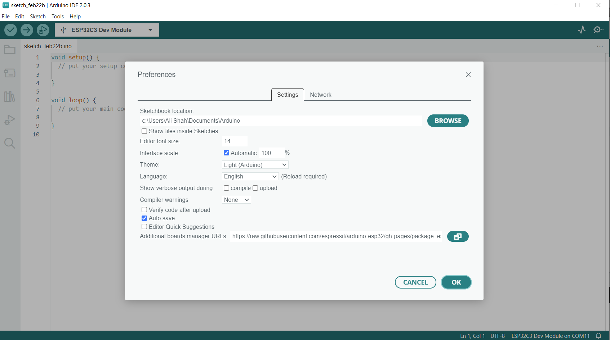
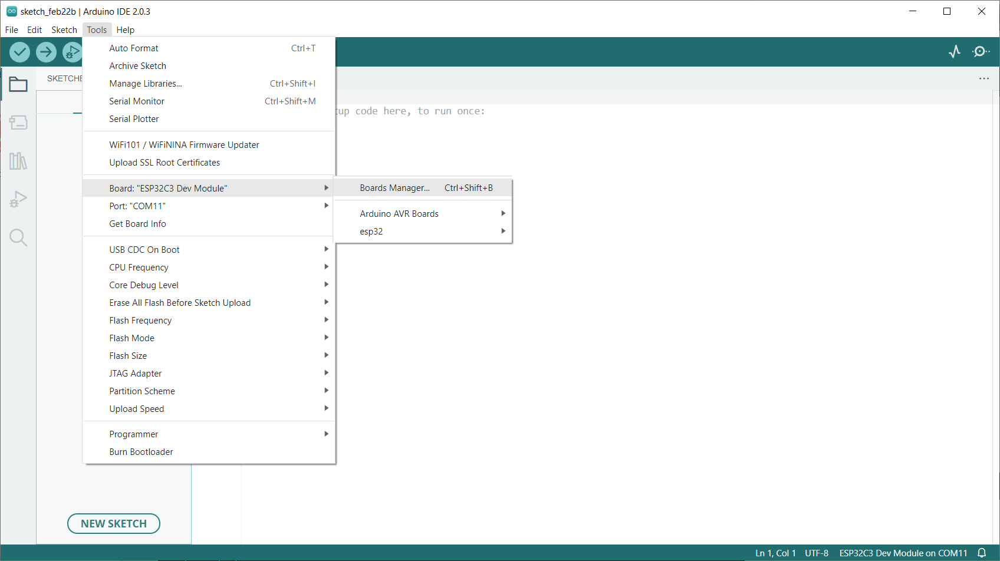
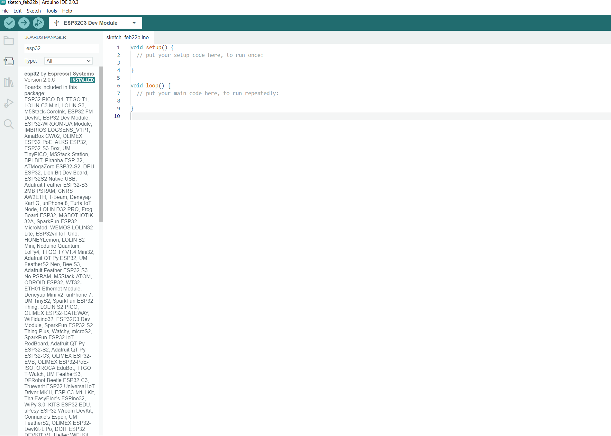
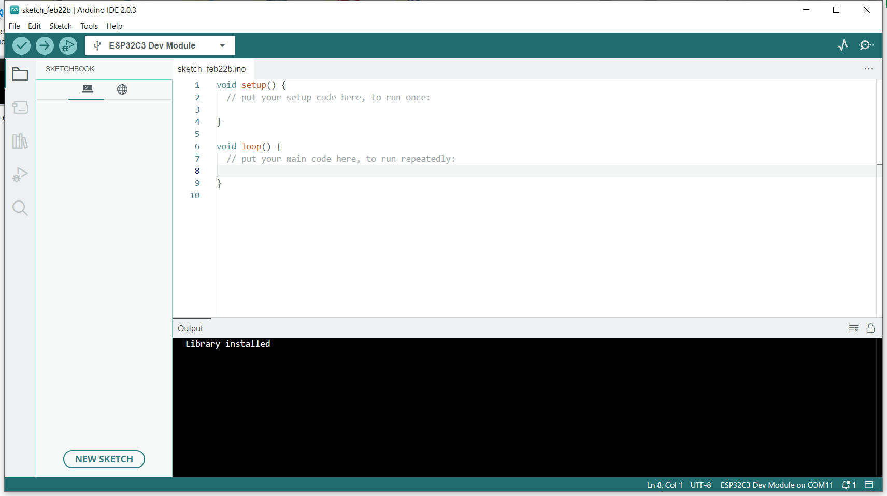

# How to Use a Library in Arduino IDE

## Step 1: Installing the ESP32 Add-on in Arduino IDE
1. Open Arduino IDE and go to File > Preferences.
<p align="center">
  
</p>

2. In the "Additional Board Manager URLs" field, enter the following URL: 
```
https://raw.githubusercontent.com/espressif/arduino-esp32/gh-pages/package_esp32_index.json.

```
Click "OK" to save the changes.
3. Go to Tools > Board > Boards Manager.
<p align="center">
  
</p>

4. In the search bar, type "ESP32" and click on "ESP32 by Espressif Systems".
<p align="center">
  
</p>
Click "Install" and wait for the installation to complete.

## Step 2: Importing the Library into Arduino IDE

1. Download the library in .zip format from the source.
   
### Method 1
1. Open Arduino IDE and go to Sketch > Include Library > Add .ZIP Library.
<p align="center">
  
</p>

2. Browse to the downloaded .zip file and click "Open".
Wait for the library to be imported.

### Method 2
1. Extract the files to the location where the ESP32 core for Arduino is installed on your local system. Typically, the location of the installed ESP32 core for Arduino is as follows:
    
``` 
/home/user-name/.arduino15/packages/esp32/hardware/esp32/2.0.6/libraries

```


```
C:\Users\User-name\AppData\Local\Arduino15\packages\esp32\hardware\esp32\2.0.7\libraries\

```


## Step 3: Using the Library in Arduino Sketch
In the Arduino sketch, add the following line at the beginning of the code:
```
#include "library_name.h"

```
Replace "library_name" with the name of the library you imported.

> Refer to the library's documentation or examples to learn how to use the library in your code.
